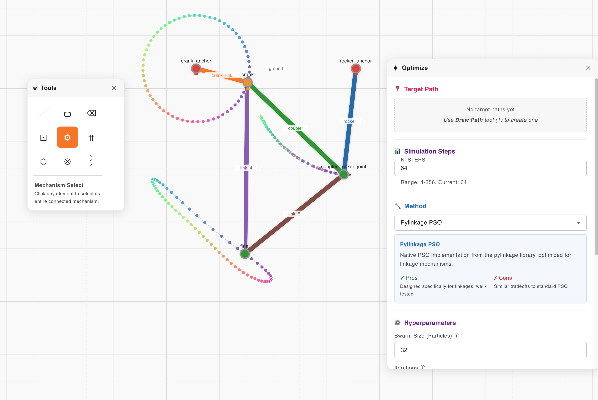

# Acinonyx

**Design tools for planar mechanisms, automata, and path synthesis—with a full UI for building, simulating, and optimizing linkages.**


Acinonyx provides an editor, simulation (via [pylinkage](https://github.com/HugoFara/pylinkage)), and optimization so you can design mechanisms whose motion traces a target path. Strong exploration tools let you preview thousands of trajectory possibilities at once—see what the mechanism can do before committing. The toolkit also supports link and polygon forms and automatically computes which physical layer each part would occupy in a real 3D build (polygon- and shape-aware), so you can design mechanisms that are constructible and collision-free. You can refine these structures to match desired trajectories and constraints.


---

*The name comes from Greek: **akinetos** (ἀκίνητος) meaning "unmoved" + **onyx** (ὄνυξ) meaning "claw"—the genus of the cheetah, swift and precise.*

---



### Features

- **Mechanism Builder**: Interactive graph-based editor for designing multi-link planar mechanisms
- **Explore Trajectories**: Preview thousands of possible paths on multiple joints in a combinatoric manner so you can explore what the mechanism can do.
- **Trajectory Simulation**: Compute and visualize joint paths using [pylinkage](https://github.com/HugoFara/pylinkage)
- **Path Optimization**: Fit mechanisms to target curves with global optimization
- **Collision Aware Forms**: Know which physical level each link would occupy in a real 3D build (polygon/shape aware), so designs are constructible and collision-free
- **Modern Stack**: React frontend + FastAPI backend with real-time updates

## Requirements

- Python >= 3.11
- Node.js >= 18 (for frontend)
- Conda, pip, or pyenv
- See `pyproject.toml` for complete dependency list

## Installation

### 1. Clone the Repository

```bash
git clone <repository-url>
cd acinonyx
```

### 2. Set Up Python Environment

Use **Python 3.11.x**. Prefer a dedicated environment (conda, venv, or pyenv) so dependencies don’t conflict with other projects.

**Full vs minimal install**

- **Full** (recommended): installs optional packages for all optimization methods, tooling, and image analysis. Use this unless you encounter errors during install.
- **Minimal**: core and linkage/optimizer basics only. Most of the UI works; if you see a missing-module error, switch to the full install.

Below, each option shows the **full** install first; the **minimal** command is at the end of that option.

#### Option A: Using Conda

```bash
conda env create -f environment-all.yml
conda activate acinonyx
```

Minimal: `conda env create -f environment.yml` then `conda activate acinonyx`.

#### Option B: Using pip

```bash
python -m venv acinonyx
# Activate: on Windows venv\Scripts\activate ; on Unix/macOS source venv/bin/activate

pip install -e ".[all]"
```

Minimal: `pip install -e .` (after creating and activating the venv).

#### Option C: Using pyenv

Requires [pyenv-virtualenv](https://github.com/pyenv/pyenv-virtualenv). Use Python 3.11.x.

```bash
pyenv install 3.11.9
pyenv virtualenv 3.11.9 acinonyx
pyenv activate acinonyx

pip install -e ".[all]"
```

Minimal: `pip install -e .` instead of the last line.

### 3. Install Frontend Dependencies

The UI is a Node.js app. You need **Node.js** (which includes **npm**) before running the frontend.

- **Install Node.js**: Use the [official installer](https://nodejs.org/) (LTS, e.g. 18 or 20) or your system package manager (`brew install node`, `apt install nodejs npm`, etc.). Check with `node -v` and `npm -v`.
- **npm install**: From the project root, install the frontend’s dependencies (and create `frontend/node_modules`):

```bash
cd frontend
npm install
```

### 4. Verify Installation

Run the test suite to ensure everything is working:

```bash
# Using pytest
pytest tests/ -v
```

or with conda perhaps

```bash
conda activate acinonyx
pytest tests/ -v
```


## Usage


### Configuration

The application uses `configs/appconfig.py` for centralized configuration:

- **USER_DIR**: Location for saved graphs and user data (`user/` directory)
- **BACKEND_PORT**: `8021` - FastAPI backend server port
- **FRONTEND_PORT**: `5173` - Vite development server port
- **API URLs**: Automatically constructed from port configuration

All port settings are centralized in `appconfig.py` - modify this file if you need to change ports due to conflicts.


### Quick Start

There are two scripts to start the development environment:

#### Option A: `run.sh` (Recommended for Unix/macOS)

The full-featured bash script with environment checks, colored output, and automatic browser opening:

```bash
# On Unix/macOS:
chmod +x run.sh
./run.sh
```

**What it does:**
- Checks Python, Node.js, and npm versions
- Auto-detects and resolves port conflicts
- Installs missing dependencies if needed
- Opens browser automatically when ready
- Streams colored logs from both servers
- Use `./run.sh -q` or `./run.sh --quick` to skip dependency checks

#### Option B: `start_dev.py` (Cross-platform)

A simpler Python script that works on Windows, macOS, and Linux:

```bash
python start_dev.py
```

---

Both scripts will:
1. Start the FastAPI backend server on `http://localhost:8021` (configured in `configs/appconfig.py`)
2. Start the Vite development server on `http://localhost:5173`
3. Handle graceful shutdown on Ctrl+C

### Manual Start

If you prefer to run the servers manually:

#### Terminal 1 - Backend Server

```bash
# Activate your environment first
conda activate acinonyx  # or: source venv/bin/activate

# Start backend
cd backend
python run_server.py
```

The API will be available at `http://localhost:8021` (or port configured in `appconfig.py`)

#### Terminal 2 - Frontend Server

```bash
cd frontend
npm run dev
```

The web interface will be available at `http://localhost:5173` (or port configured in `appconfig.py`). This is the URL you are looking for!

### API Documentation

Once the backend is running, you could also visit:
- Swagger UI: `http://localhost:8021/docs`
- ReDoc: `http://localhost:8021/redoc`
- Status Check: `http://localhost:8021/status`

## Troubleshooting

### Common Issues

**1. Module not found errors**
- Ensure your conda environment is activated:
  * for example if using pyenv `pyenv activate acinonyx`
  * * for example if using anaconda `conda activate acinonyx`
- Verify installation: `pip list | grep acinonyx`

**2. Frontend not loading**
- Check Node.js version: `node --version` (should be >= 18)
- Reinstall dependencies: `cd frontend && npm install`

**3. Backend connection refused**
- Verify backend is running: `curl http://localhost:8021/status`
- Check for port conflicts (default port is 8021, see `configs/appconfig.py`)
- Ensure CORS is properly configured

**4. Tests failing**
- Ensure pytest is installed: `pip install pytest pytest-cov`
- Check Python version: `python --version` (should be >= 3.11)

**5. Port conflicts**
- If ports 8021 or 5173 are already in use, edit `configs/appconfig.py` to change ports
- Restart both backend and frontend servers after changing ports

## Why Doesn't My Mechanism Work?

There are countless ways to create a poorly-formed mechanism that doesn't meet the requirements for trajectory calculation in this implementation. It's possible to create fully constrained systems—think of a rigid cube—that obviously can't be animated.

**Understanding Node Types**

First, note that there are three kinds of nodes:

- **Static** — A fixed anchor point that doesn't move. It serves as a ground reference for the mechanism. Press `W` to convert a node to Static.
- **Crank** — A node that rotates around a fixed point (its parent Static node) at a constant radius. The crank provides the input motion that drives the mechanism. Press `A` to convert a node to Crank.
- **Revolute** — A pivot joint whose position is determined by constraints from two parent nodes. Most nodes in a mechanism are Revolute joints. Press `Q` to convert a node to Revolute.

**The Crank Requirement**

In this implementation, there must be at least one Crank node, and that crank must be able to make a full revolution. It's *very easy* to accidentally make even the simplest system over-constrained by making a single link too long or too short! You can see a minimal working example in the Demo section by clicking "Four Bar." If you're having problems with your mechanism, try shortening or lengthening a link.

**Over Constrained Mechanisms**

There are many mechanisms that are invalid simply because the links would have to strech, bend, or break to allow the crank to turn; within numerical tolerances we try not to allow these ever.

If you're wondering why your four-bar linkage won't complete a full rotation, consider **Grashof's Law**: For four-bar linkages, this law predicts whether continuous rotation is possible based on link lengths. Let *s* = shortest link, *l* = longest link, and *p*, *q* = the other two links. If *s* + *l* ≤ *p* + *q*, the linkage permits continuous rotation (crank-rocker or double-crank). Otherwise, it's a non-Grashof linkage limited to oscillation (double-rocker). Note: The current implementation doesn't support double-rocker oscillation.

**Under-Constrained Mechanisms**

Just as we can over-constrain and lock a mechanism, we can also under-constrain them. If you make a triangle of links, it's locked in shape and will compute correctly. However, if you make a square of links, it would collapse into a parallelogram since it has an extra degree of freedom. You need to fully constrain shapes by adding additional links. For example, if you add a square of links to a working mechanism, trajectory simulation will fail—to fix this, add a diagonal cross-link to triangulate and rigidify the square.

**Summary: Making Your Mechanisms Work**

- Mark appropriate nodes as Static, Crank, or Revolute
- Shorten or lengthen links as necessary to satisfy Grashof's Law
- Fully constrain open shapes by triangulating them (add diagonal links)
- Avoid dangling or hanging links that aren't part of a closed chain


# Why This Project?

Because I wanted capable optissmizers with an easy to use frontend to generate organically realistic and buildable mechanisms with complex trajectories.

### The Problem

**Given a planar path (or set of paths), how do we construct a multi-link mechanism that closely traces those paths while satisfying design constraints?**

This is an **inverse problem** in mechanism synthesis. The goal is to choose mechanism **dimensions** (link lengths, joint positions) so that a point on the coupler link follows a target path as closely as possible. Some of the tools mentioned here address path synthesis such as SAM and LInK, however for my use case they were all limited in someway (though each has strengths). Acinonyx aims to be a flexible, open-source option with support for **multi-link** mechanisms well beyond four-bars.

**Two synthesis approaches:**
- **Dimensional synthesis** — The mechanism type (topology) is fixed; the task is to find link lengths and geometry that achieve a desired function, path, or motion. Currently we do this.

-  **type synthesis** - a designer initially specifies a predefined motion transmission and is supposed not initially to know the mechanism type. This method is analogous to topology design in structural optimization. Having finished synthesizing, a certain mechanism type is received. This is future work.

### Technical Challenges

Path synthesis is hard because:

- **Non-convex search space** — Many local minima; gradient-based methods often get stuck.
- **Mixed variables** — Both discrete choices (topology) and continuous parameters (lengths, positions).
- **Timing** — Path generation can be *without* prescribed timing (phase-invariant) or *with* prescribed timing; both cases matter in practice.

Acinonyx tackles these with multiple **distance metrics** and **global optimization** strategies, while type/topology synthesis remains ongoing work.


## Similar Projects

If you're interested in linkage mechanism design and simulation, here are some other notable tools in this space:

### Pylinkage
- **Source**: [https://github.com/HugoFara/pylinkage](- **Source**: https://github.com/HugoFara/pylinkage)
- Pylinkage is a Python library for building and optimizing planar linkages using Particle Swarm Optimization.
- **This work uses pylinkage.**

### PMKS+ (Planar Mechanism Kinematic Simulator Plus)
- **Website**: [app.pmksplus.com](https://app.pmksplus.com/)
- **Source**: [github.com/PMKS-Web/PMKSWeb](https://github.com/PMKS-Web/PMKSWeb)
- Web-based tool with advanced analysis and automatic synthesis capabilities for mechanical design optimization. Features comprehensive kinematic and force analysis, automatic linkage synthesis for desired motion, and tools to modify designs for optimal performance.

### MotionGen
- **Website**:  [https://motiongen.io](https://motiongen.io)
- App for synthesizing and simulating planar four-bar linkages. Design and animate mechanisms for walking robots, drawing bots, and grabbers. Includes 2D/3D visualization, custom shape design, SnappyXO hardware kit prototyping support, and export for 3D printing/laser-cutting.

### GeoGebra Four-Bar Coupler Curve Creator
- **Website**: [geogebra.org/m/k3VXAnXK](https://www.geogebra.org/m/k3VXAnXK)
- Interactive four-bar coupler curve creator built on the GeoGebra platform. Great for quick exploration of coupler curves.

### Linkage Mechanism Designer and Simulator
- **Website**: [blog.rectorsquid.com/linkage-mechanism-designer-and-simulator](https://blog.rectorsquid.com/linkage-mechanism-designer-and-simulator/)
- Computer-aided design program for Microsoft Windows used for prototyping mechanical linkages.

### Pyslvs-UI
- **Source**: [github.com/KmolYuan/Pyslvs-UI](https://github.com/KmolYuan/Pyslvs-UI)
- A GUI-based (PyQt5) tool for designing 2D linkage mechanisms. Python-based with optimization capabilities.

### LInK
- **Demo**: [ahn1376-linkalphabetdemo.hf.space](https://ahn1376-linkalphabetdemo.hf.space/)
- **Source**: [github.com/ahnobari/LInK](https://github.com/ahnobari/LInK)
- LInK is a novel framework that integrates contrastive learning of performance and design space with optimization techniques for solving complex inverse problems in engineering design with discrete and continuous variables. Focuses on the path synthesis problem for planar linkage mechanisms.

### SAM
- **Website**: [artas.nl](https://www.artas.nl/en/)
- Commercial software for design, motion/force analysis, and constrained optimization of linkage mechanisms and drive systems.

### Four-bar-rs
- **Demo**: [kmolyuan.github.io/four-bar-rs](https://kmolyuan.github.io/four-bar-rs/)
- **Source**: [github.com/KmolYuan/four-bar-rs](https://github.com/KmolYuan/four-bar-rs)
- Atlas-based path synthesis of planar four-bar linkages using Elliptical Fourier Descriptors.

### Wolfram Demonstrations
- **Demos**: [Four-Bar Linkage](https://demonstrations.wolfram.com/FourBarLinkage/) | [Configuration Space](https://demonstrations.wolfram.com/ConfigurationSpaceForFourBarLinkage/)
- Interactive visualizations of four-bar linkage motion and configuration space exploration.

### SpatialGraphEmbeddings
- **Website**: [jan.legersky.cz/project/real_embeddings_of_rigid_graphs](https://jan.legersky.cz/project/real_embeddings_of_rigid_graphs/)
- **Source**: [github.com/Legersky/SpatialGraphEmbeddings](https://github.com/Legersky/SpatialGraphEmbeddings)
- Implements methods for obtaining edge lengths of minimally rigid graphs with many real spatial embeddings. Based on sampling over a two-parameter family that preserves the coupler curve. Useful for studying embeddings of graphs in Euclidean space where distances between adjacent vertices must satisfy given edge lengths.


## License

TBD
